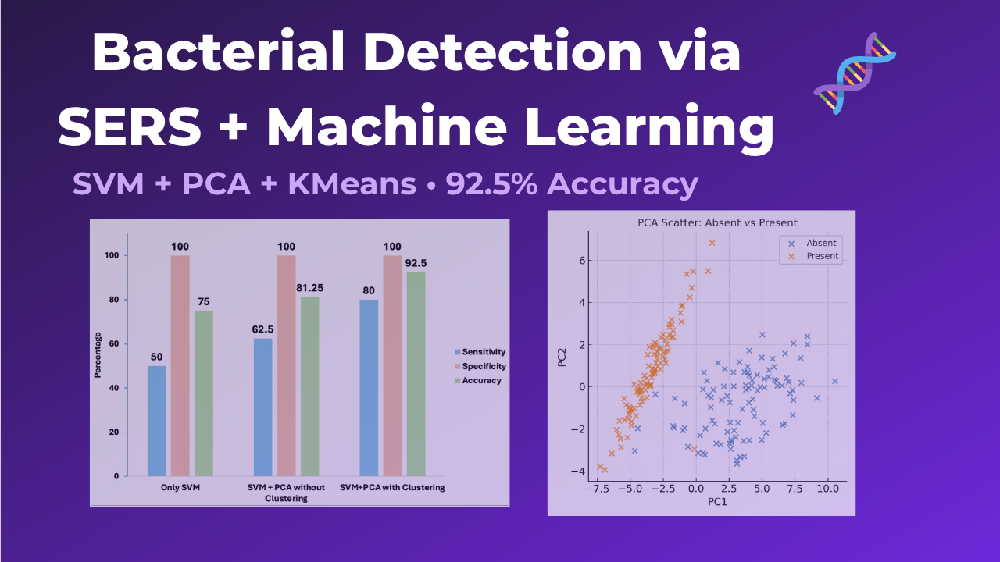
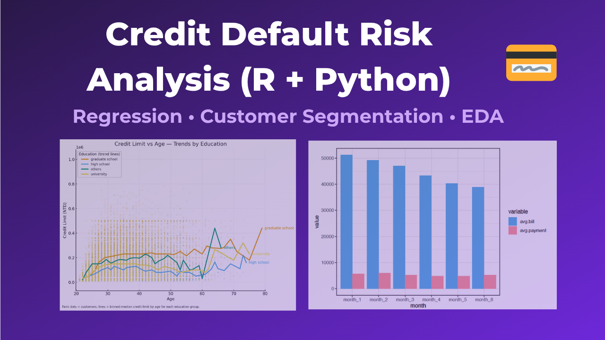
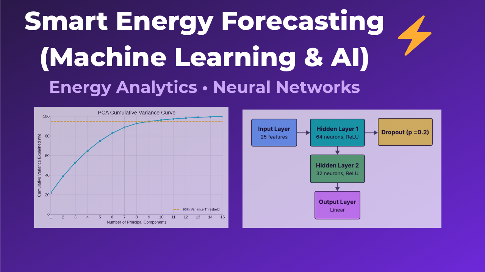
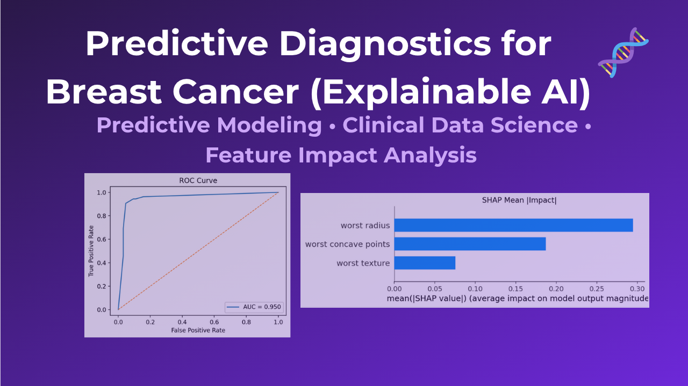
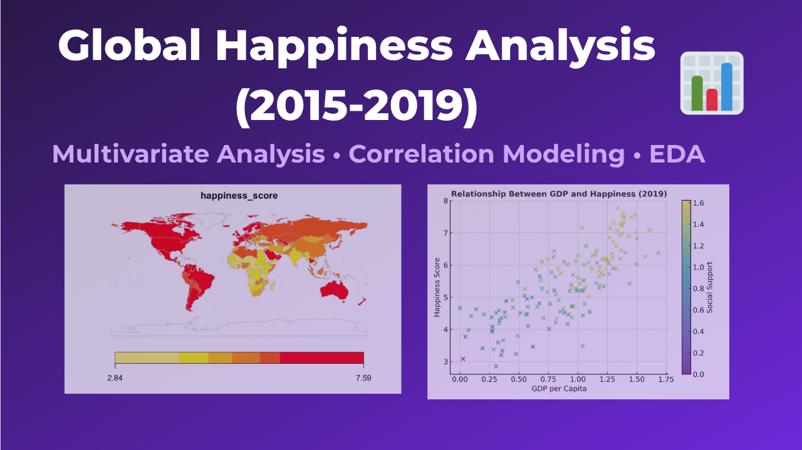
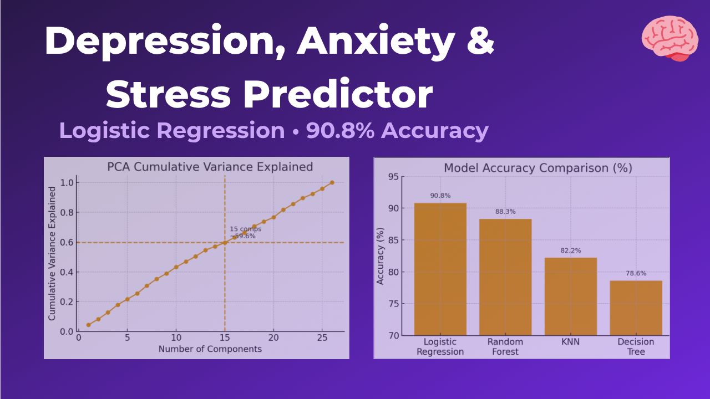
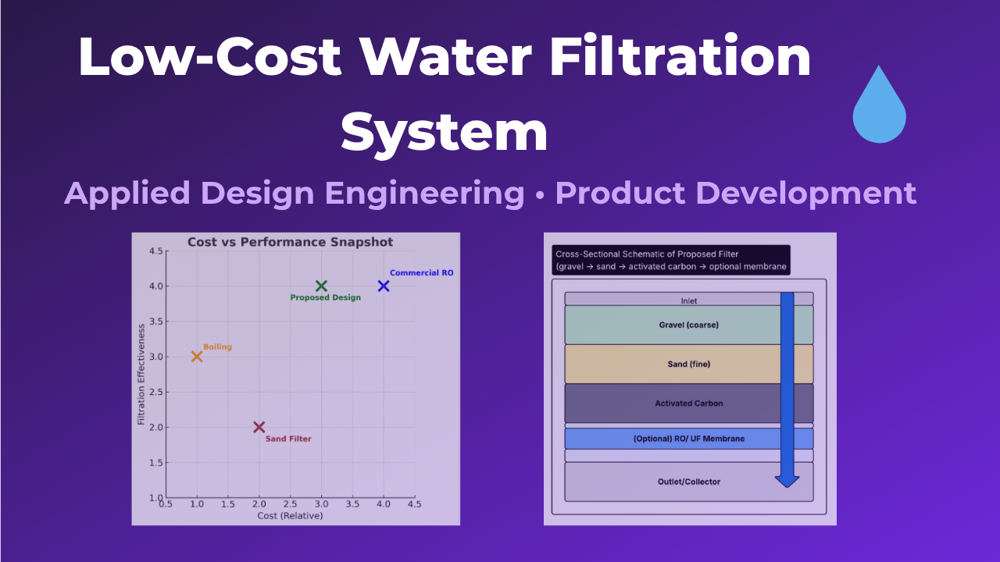

# Aradhya Agnihotri | Project Portfolio  

Welcome 👋 this is a curated portfolio showing **research**, **data analytics**, and **engineering** projects, each connecting experimental science with data-driven insight.  

---

## 🧬 Research  
*Projects focused on experimental and data-driven biomedical work*

| Project | Description | Tools |
|:---|:---|:---|
| [**Bacterial Detection via SERS + ML**](./projects/01_research_sers-biofilm)   | Detected bacterial biofilms on corneal tissue using **Surface-Enhanced Raman Spectroscopy (SERS)** and machine learning classification. | Python · SERS · scikit-learn |

---

## 📊 Data Analytics  
*Business and ML analytics for decision optimization*

| Project | Description | Tools |
|:---|:---|:---|
| [**Credit Risk Analytics**](./projects/02_analytics_credit-risk)   | Built logistic regression and random forest models to predict credit card default risk with explainability analysis. | Python · scikit-learn · EDA |
| [**Appliance Energy Prediction**](./projects/03_analytics_energy-prediction)   | Predicted household appliance energy consumption using regression and time-series models. | Python · Pandas · Statsmodels |
| [**Breast Cancer Classification**](./projects/04_analytics_breast-cancer)   | Implemented feature selection (RFECV) and explainability (SHAP, LIME) for medical classification. | Python · ML · Explainability |
| [**World Happiness Analysis in R**](./projects/05_analytics_world-happiness)   | Explored global happiness trends and socioeconomic indicators using visual analytics in R. | R · ggplot2 |
| [**Depression, Anxiety & Stress Predictor**](./projects/06_analytics_dass-predictor)   | Classified mental-health survey responses using ML; achieved ~86% ROC-AUC. | Python · scikit-learn |

---

## ⚙️ Engineering  
*Applied materials and design projects*

| Project | Description | Tools |
|:---|:---|:---|
| [**Failure Analysis of Stainless Steel**](./projects/07_engineering_failure-analysis)   | Investigated fracture mechanisms through microscopy and mechanical testing. | SEM · Failure Analysis · Metallography Metallography |
| [**Water Filtration System**](./projects/08_engineering_water-filtration)   | Designed and prototyped a sustainable, low-cost filtration unit for rural applications. | Design · Cost Optimization · MVP Prototyping |

---

### 🧭 Explore All Projects  
🔗 [Browse `/projects`](./projects) for full project directories and detailed READMEs.  

---

### 💡 About  

**Aradhya Agnihotri**  
Biomedical Engineer · Data Analyst · Researcher   
Interested in **biotech**, **AI for healthcare**, and **data-driven systems design**.  

---

