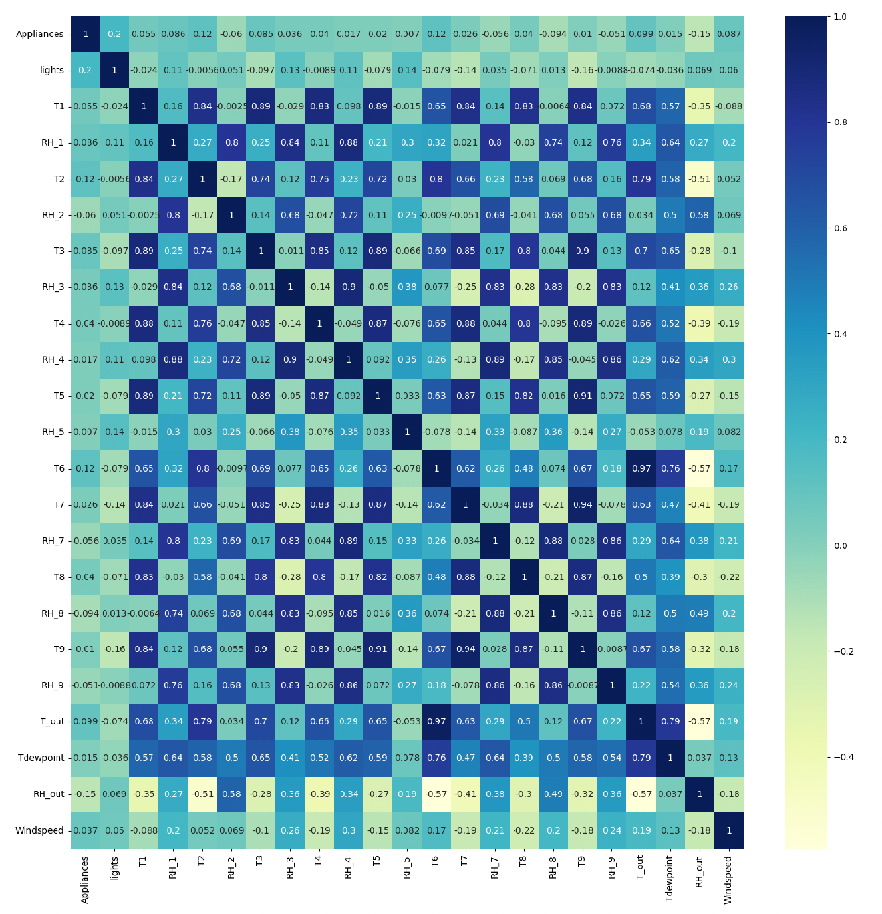

# Appliance Energy Prediction using Machine Learning  

Predicting household energy consumption using regression and neural network models for smarter energy management.  

---

## 🧩 Problem Statement  
Growing energy demands make it essential to understand and optimize household power usage.  
This project builds predictive models to estimate **appliance energy consumption** using indoor climate data, humidity, temperature, and external conditions.  
By accurately forecasting energy usage, such models can help design **smarter energy management systems** that reduce waste and improve efficiency.

---

## 📊 Dataset  
- **Source**: [UCI Machine Learning Repository – Appliances Energy Prediction Dataset](https://archive.ics.uci.edu/ml/datasets/Appliances+energy+prediction)  
- **Records**: 19,735 instances (each representing 10-minute intervals over 4.5 months)  
- **Attributes**: 29 (temperature, humidity, weather, and time-based variables)  
- **Target**: `Appliances`: household energy use (Wh)  

---

## ⚙️ Approach  

### **Workflow Overview**

1. **Data Preprocessing**  
   - Checked for null values (none found)  
   - Outlier detection using DBSCAN and LOF  
   - Log normalization of skewed target variable  

2. **Exploratory Data Analysis (EDA)**  
   - Identified energy consumption patterns across time and day  
   - Analyzed correlations among temperature and humidity features  

3. **Feature Engineering**  
   - Recursive Feature Elimination (RFE) for top predictors  
   - PCA to reduce 27 features → 9 components (capturing 95 % variance)  

4. **Modeling**  
   - Regression: Linear, Ridge, Lasso  
   - Neural Network: 2 hidden layers (ReLU), Dropout 0.2  
   - Compared before/after PCA for performance changes  

5. **Evaluation**  
   - Metrics: R² Score, Bias–Variance Trade-off  
   - Cross-validated models to ensure reliability  

---

## 🎨 Visuals  

### **Exploratory Data Analysis**

**Target Variable Distribution**

*Energy consumption is right-skewed, with most readings under 100 Wh.*

**Log Transformation Effect**

*Log normalization reduced skewness and stabilized variance.*

**Outlier Detection**

*DBSCAN identified high-usage spikes retained as valid surges.*

**Local Outlier Factor (LOF)**

*LOF confirmed outliers behaved similarly to regular points.*

**Target Variable Boxplot**

*High-end outliers correspond to genuine consumption peaks.*

**Correlation Matrix**

*Temperature (T1–T9) and Humidity (RH1–RH9) groups show strong intra-correlation.*

**Consumption by Day & Hour**

*Weekends (Fri–Sun) record higher usage than weekdays.*

*Energy peaks around 7 PM — matching evening household activity.*

---

### **Feature Engineering**

**Top 20 Features Selected via RFE**

*Top 5 predictors (gold) had strongest influence on appliance energy.*

**PCA Variance Curve**

*9 components capture 95 % of total variance.*

**Before vs After PCA**

*Dimensionality reduced from 27 → 9 principal components.*

---

### **Modeling and Results**

**Model Performance (R²)**

*Neural Network achieved highest R² before PCA.*

**PCA Effect on Models**

*LASSO improved most after PCA, showing reduced overfitting.*

**Neural Network Architecture**

*Two hidden layers (ReLU) + Dropout (0.2) prevented overfitting.*

---

## 📈 Results  

| Model | R² (Before PCA) | R² (After PCA) | Observation |
|:------|:----------------:|:---------------:|:-------------|
| **Linear Regression** | 0.82 | 0.84 | Small gain after PCA |
| **Ridge Regression**  | 0.85 | 0.87 | Regularization stabilized predictions |
| **Lasso Regression**  | 0.83 | **0.89** | Best among regressors after PCA |
| **Neural Network**    | **0.90** | 0.86 | Best overall before PCA |

---

## 💡 Key Insights  

- **Lasso Regression** → Best model after PCA (simpler, more generalizable)  
- **Neural Network** → Best before PCA (highest accuracy on raw features)  
- **PCA** → Reduced dimensionality (27 → 9) while retaining 95 % variance  
- Weekends and evenings show peak energy consumption  
- Strong correlations among indoor climate variables indicate redundancy handled well by PCA  

---

## 🚀 Next Steps  

- Extend models to forecast energy usage as a **time-series problem** (ARIMA, LSTM)  
- Integrate external weather feeds for real-time prediction  
- Build interactive dashboards for smart home energy insight  
- Explore classification of usage patterns (low/medium/high consumption)  

