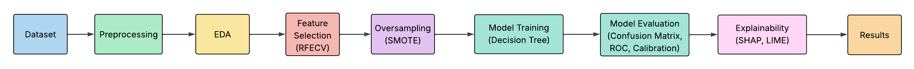

# Breast Cancer Classification with Explainable AI  

This project applies **machine learning and explainable AI (XAI)** to the **Wisconsin Diagnostic Breast Cancer dataset** to classify tumors as **benign (1)** or **malignant (0)**.  
The focus is not only on achieving strong performance but also on ensuring **interpretability and trustworthiness** — key requirements for healthcare applications.  

          

---

## 🧩 Problem Statement  
Breast cancer is one of the most common cancers worldwide.  
Machine learning can assist in **early detection**, but models must be both **accurate** and **explainable** to be clinically useful.  

This project builds an **interpretable Decision Tree model** optimized for **F1 score** using **feature selection (RFECV)** and **class imbalance handling (SMOTE)**.  
We also integrate explainability tools (Permutation Importance, SHAP, PDP, LIME) and probability calibration to ensure trust in predictions.  

---

## 📊 Dataset  
- **Source**: Built-in `sklearn.datasets.load_breast_cancer`  
- **Samples**: 569 tumors  
- **Features**: 30 numeric features (e.g., mean radius, worst texture, concavity error)  
- **Target**:  
  - `0` = Malignant  
  - `1` = Benign  

### Class Balance
The dataset is **imbalanced**:  
- ~63% Benign  
- ~37% Malignant  
→ Handled via **SMOTE oversampling inside cross-validation**.  

  

---

## ⚙️ Approach  

**Pipeline (ML Workflow): End-to-end workflow from dataset to results**  
 

1. **Data Preprocessing**  
   - Scaling via MinMaxScaler  
   - Stratified train/test split  

2. **Exploratory Data Analysis (EDA)**  
   - Correlation heatmaps (full + subset)  
   - Feature distribution plots (boxplots for top features)  

3. **Feature Selection**  
   - RFECV (DecisionTree, 10-fold CV, scoring=F1)  
   - Selected 3 features: `worst radius`, `worst texture`, `worst concave points`  

4. **Modeling**  
   - Pipeline: `SMOTE → DecisionTree`  
   - Hyperparameter tuning with **GridSearchCV (10-fold, F1)**  

5. **Evaluation**  
   - Classification report (Acc, Precision, Recall, F1, ROC-AUC)  
   - Confusion Matrix  
   - ROC Curve  
   - Precision–Recall vs Threshold  
   - Calibration Curve  

6. **Explainability**  
   - **Permutation Importance**  
   - **SHAP (beeswarm, bar, dependence plots)**  
   - **Partial Dependence + ICE**  
   - **LIME** for local case explanations  

---

## 📈 Results  

| Metric      | Value (~) |
|-------------|-----------|
| Accuracy    | 92.98%    |
| Precision   | 94.39%    |
| Recall      | 94%       |
| F1 Score    | 94%       |
| ROC-AUC     | 95.04%    |

**Confusion Matrix**  
The model correctly classified **159 out of 171 patients**, with only 6 false positives and 6 false negatives. Errors were balanced, giving ~94% across precision, recall, and F1.   

---

**ROC Curve**  
An **AUC of 0.95** demonstrates excellent ability to separate benign from malignant tumors in this dataset. The sharp curve indicates few false alarms at high sensitivity, important for medical screening.  

---

**Calibration Curve**  
Predicted probabilities closely matched actual outcomes (points near diagonal), showing the model is not just accurate, but also **well-calibrated** for probability-based decision-making.  

  

---

**Precision-Recall vs Threshold**  
The model maintained both high precision and recall above 90% across a wide range of thresholds, meaning predictions are reliable even if the cutoff probability is adjusted.   

---

**Calibration Curve**  
Predicted probabilities closely matched actual outcomes (points near diagonal), showing the model is not just accurate, but also **well-calibrated** for probability-based decision-making.   

---

## 🎨 Visuals  

**Correlation Heatmap (All Features)**  
Many of the 30 features are highly correlated (e.g., *mean radius, mean perimeter, mean area*). This confirmed the need for dimensionality reduction and feature selection to avoid redundancy.  

---

**Correlation Heatmap (Selected Features)**  
After RFECV, the three strongest predictors emerged: *worst radius, worst concave points, worst texture*. The focused heatmap shows they are less correlated with each other, justifying their selection.

---

**Permutation Feature Importance**  
On the test set, *worst concave points* and *worst radius* caused the largest drops in accuracy when permuted, proving they are essential to classification.   

---

**SHAP Beeswarm (Global)**  
For individual patients, high values of *worst radius* and *worst concave points* consistently pushed predictions toward malignancy, while lower values pushed toward benign.   

---

**SHAP Mean |Impact| (Bar)**  
Across the test set, *worst radius* contributed the most to the model’s decision process, reinforcing what we saw in permutation importance. 

---

**SHAP Dependence Plot**  
Higher *worst radius* values strongly increased malignancy prediction, especially when paired with high *worst texture*. This reveals an interaction between tumor size and texture.  

---

**Partial Dependence & ICE (PDP + ICE)**  
When *worst concave points* exceeded ~0.5, predictions shifted sharply toward malignancy for most patients, confirming this threshold as clinically meaningful.  

---

**LIME Explanation (Local)**  
For a specific test patient, LIME showed that *worst concave points > 0.57* was the decisive feature driving the prediction of malignancy, a transparent case-level justification.  

---

**Boxplots (EDA)**  
Malignant tumors consistently had higher values for *worst concave points* and *worst radius*, while benign cases had lower, tighter distributions. This aligns with model explanations from SHAP and LIME.  
  
  

---

## 💡 Key Insights  
- Only **3 features** were needed for strong performance (`worst radius`, `worst texture`, `worst concave points`).  
- The model achieved **ROC-AUC ~0.95** with balanced precision/recall.  
- **Consistent importance across methods**: permutation, SHAP, PDP all confirmed the same top features.  
- **Interpretability tools (SHAP, LIME, PDP)** provide transparency into predictions.  
- **Threshold and calibration analysis** make the model more aligned with real-world healthcare workflows.  

---

## 🚀 Next Steps  
- Extend pipeline to **Random Forest / Gradient Boosting** and compare explainability.  
- Explore **probability calibration methods** (Platt scaling, isotonic regression).  
- Develop a **cost-sensitive thresholding strategy** for healthcare contexts.  
- Wrap pipeline into a **deployable API or app** for end-to-end demo.  

---

## ⚖️ Disclaimer  
This project is for **educational and portfolio purposes only**.  
Not intended for direct clinical use.  

---

