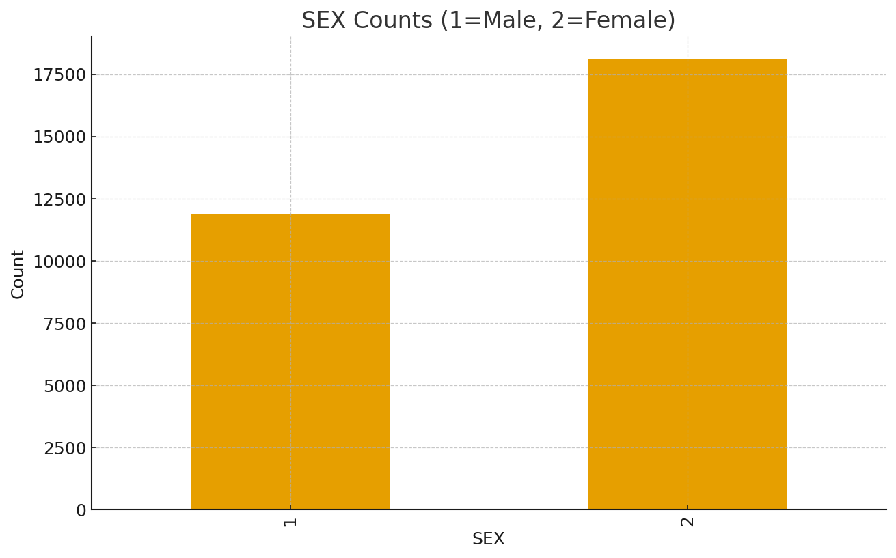
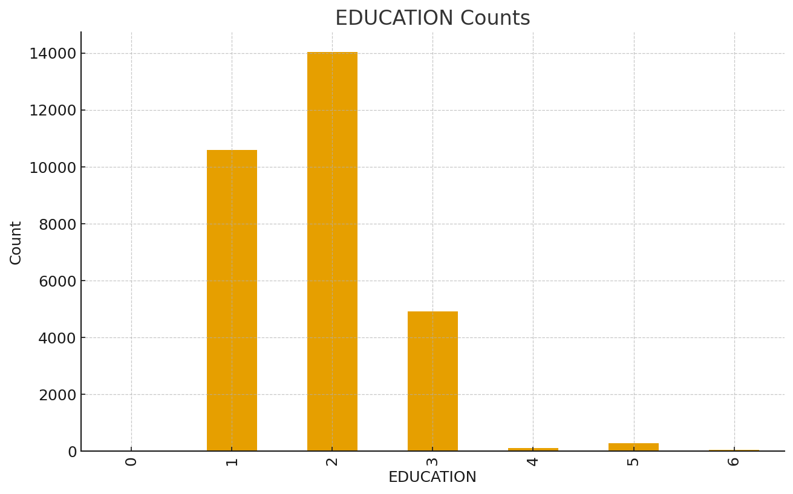
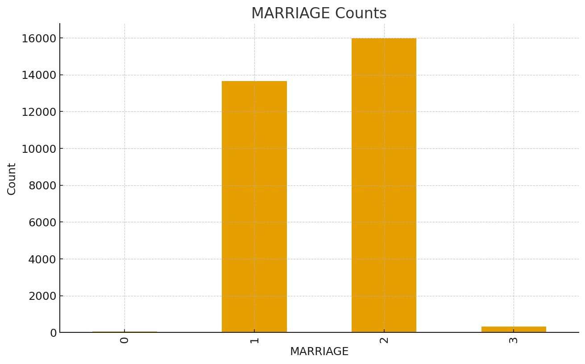
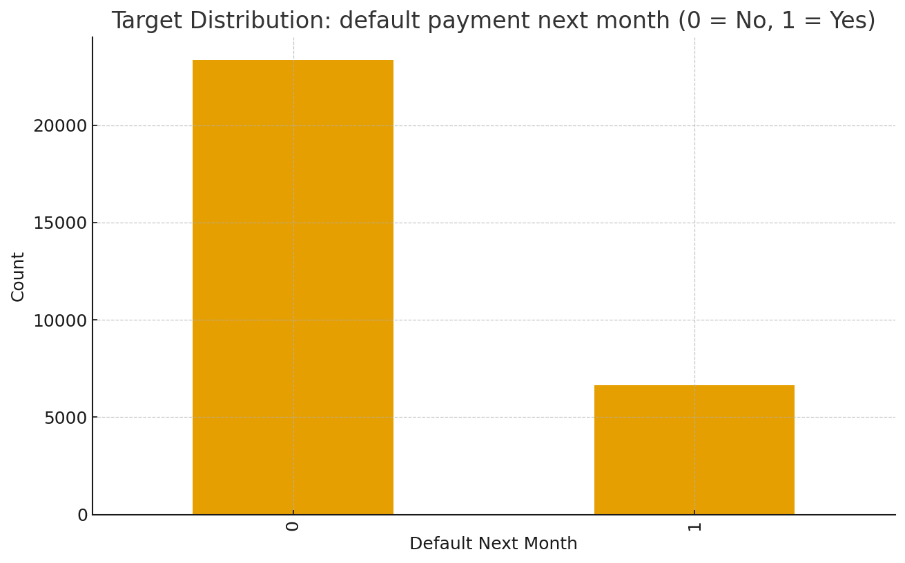
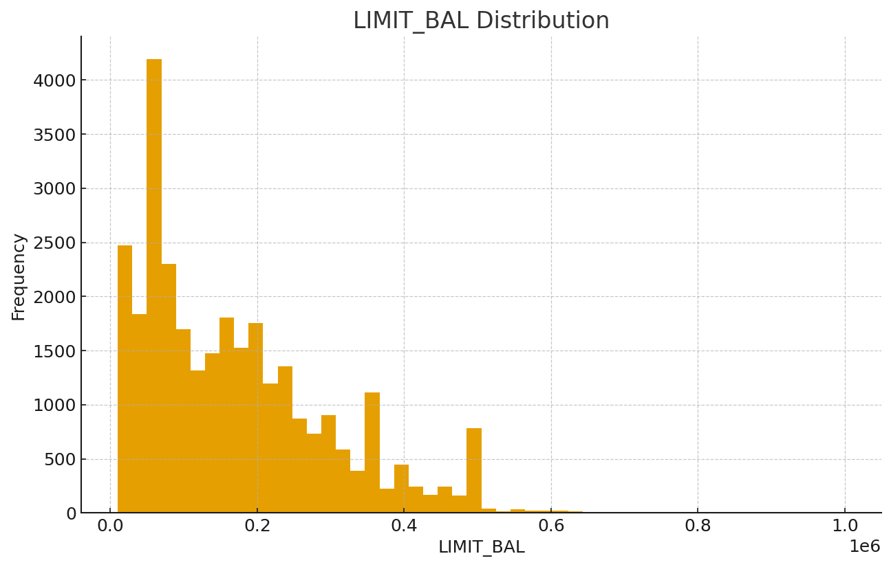
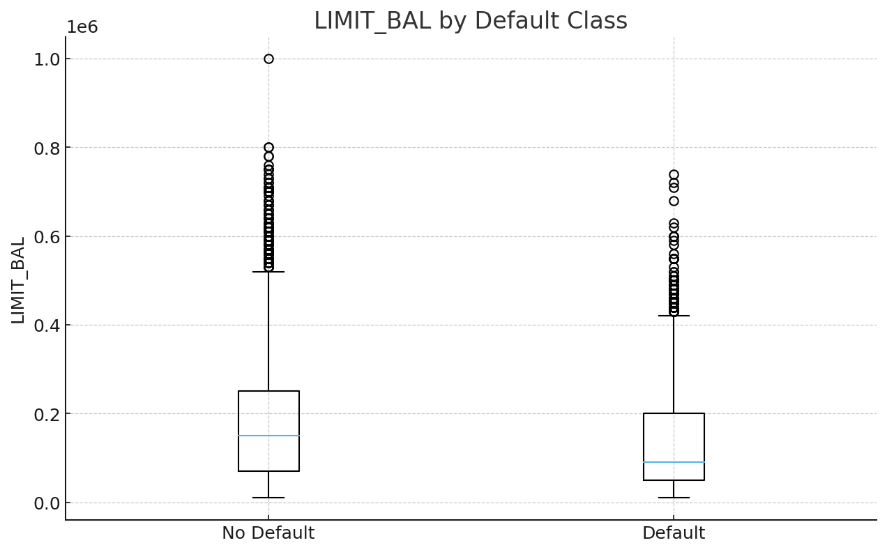
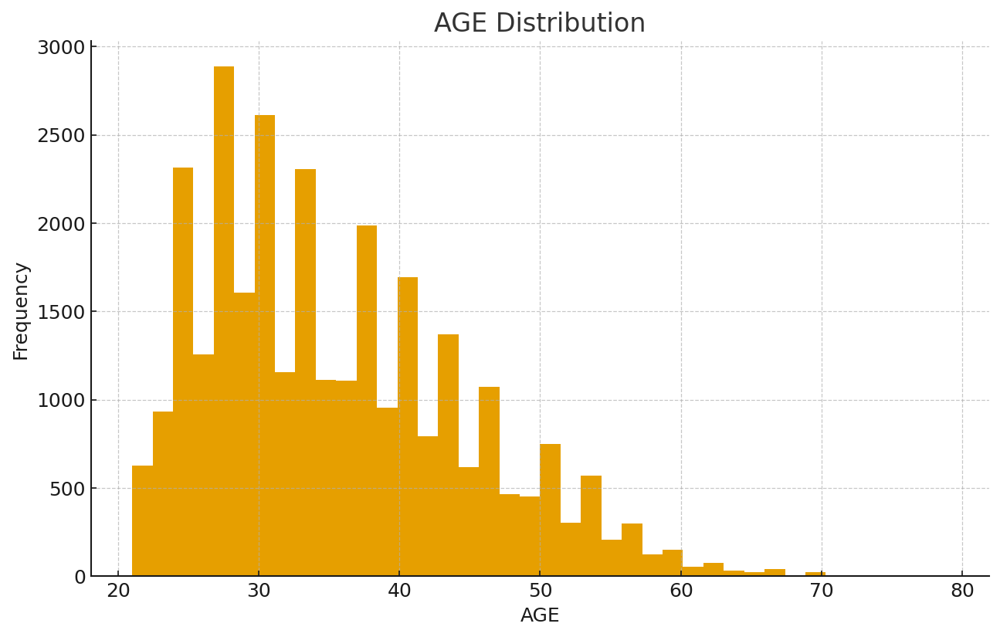
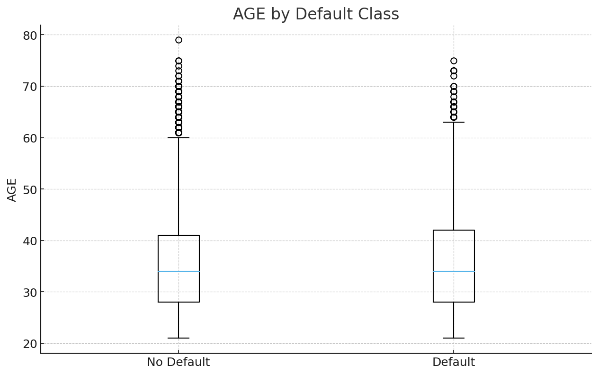
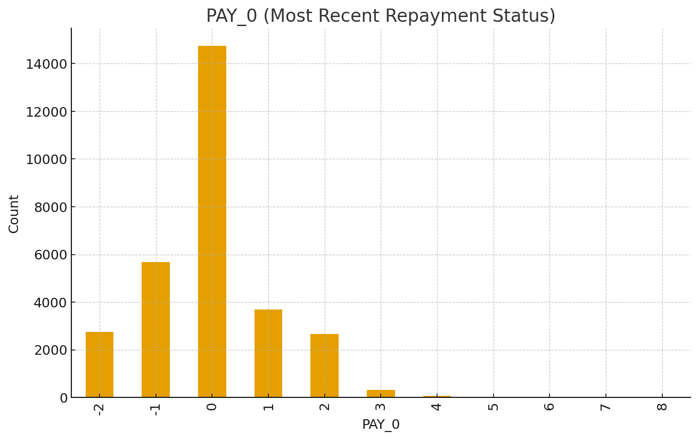
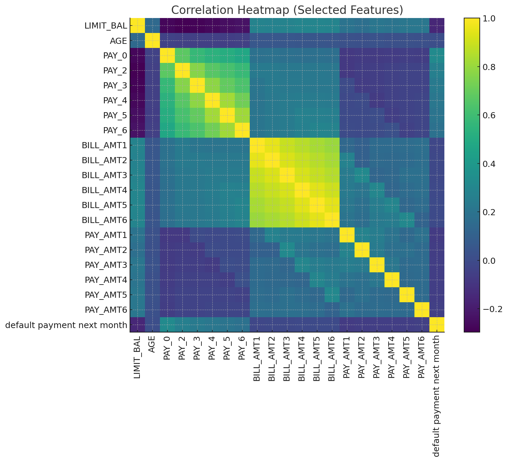

# Credit Risk Analytics: Understanding Customer Defaults with R  

Exploring customer behavior and repayment trends using **R** to uncover drivers of **credit card payment defaults**.  
This project applies **credit risk analytics**, **data visualization**, and **customer segmentation** techniques to identify patterns that signal financial distress.

---

## 🧩 Problem Statement  

Credit card defaults are one of the most common and costly risks faced by financial institutions.  
This project investigates **how customer demographics, credit limits, and repayment patterns** affect default probability, helping identify high-risk customer segments early.

---

## 📊 Dataset  

- **Source:** UCI Machine Learning Repository – *Default of Credit Card Clients*  
- **Records:** 30,000 clients (Taiwan, 2005)  
- **Target:** `df_pay` → 1 = Default, 0 = No Default  
- **Categories:**  
  - **Demographic:** SEX, EDUCATION, MARRIAGE, AGE  
  - **Financial:** LIMIT_BAL, BILL_AMT1–6, PAY_AMT1–6  
  - **Behavioral:** PAY_0–PAY_6 (repayment status for last six months)

---

## ⚙️ Workflow Overview  

1. **Data Wrangling:** cleaned categorical encodings, grouped anomalies, renamed variables for clarity.  
2. **Exploratory Analysis:** visualized distributions, repayment trends, and credit relationships.  
3. **Insight Generation:** interpreted behavioral and demographic factors that drive repayment reliability.  

---

## 📈 Exploratory Data Analysis  

### **1. Customer Demographics**

 

*Majority of clients are female and university-educated — a young professional customer base.*

*Married and single clients dominate; marital stability aligns with stronger repayment discipline.*

---

### **2. Default Distribution**

*Roughly 22 % of clients defaulted, highlighting a class imbalance that mirrors real credit portfolios.*

---

### **3. Credit Limit Patterns**

 

*Defaulters generally have lower credit limits, indicating lenders reward repayment consistency with higher credit capacity.*

---

### **4. Age Influence on Default**

 

*Most clients are aged 25–40. Older customers default less often in absolute terms but show higher relative risk within their group.*

---

### **5. Education and Default Behavior**

*University graduates represent the largest share of defaulters, reflecting their dominance in the dataset rather than educational risk.*

---

### **6. Gender and Limit Balance**

*Females hold slightly higher credit limits on average, consistent with better repayment discipline observed in the data.*

---

### **7. Repayment Behavior**

*Most clients pay on time (status 0), but late payments of 1–2 months are early signals of financial strain.*

---

### **8. Correlation Matrix**

*Bill and payment amounts are highly correlated; repayment status variables (PAY_0–PAY_6) show the strongest link with default probability.*

---

### **9. Monthly Bill vs Payment Trend**

*Average billing amounts decrease slightly over months, while payments remain consistently lower, suggesting reliance on revolving credit.*

---

### **10. Bills and Payments: Defaulters vs Non-Defaulters**

*Non-defaulters consistently pay larger portions of their bills; defaulters maintain smaller payments relative to total balance.*

---

### **11. Education × Age Heatmap**

*Clients with graduate education in middle-to-senior age groups enjoy higher credit limits. This is likely due to income maturity and tenure.*

---

## 📊 Summary of Findings  

| Factor | Observation | Implication |
|:-------|:-------------|:-------------|
| **Repayment History** | Strongest predictor of default behavior | Early delinquency signals future risk |
| **Credit Limit** | Lower among defaulters | Reflects trust and repayment history |
| **Age** | Middle-aged clients maintain best repayment records | Suggests income stability advantage |
| **Marital Status** | Married clients default less | Indicates potential correlation with financial stability |
| **Bill vs Payment Ratio** | High unpaid ratios correlate with defaults | Metric useful for credit monitoring dashboards |

---

## 💡 Key Insights  

- **Behavioral indicators** (repayment delay, bill–payment ratio) outweigh demographic ones.  
- **Timely payments** correlate with both higher credit limits and long-term customer retention.  
- **Combining credit limits, payment timeliness, and age** forms a reliable risk-profiling framework.  
- Insights can support **proactive limit adjustments** and **personalized credit interventions**.

---

## 🚀 Next Steps  

- Extend the analysis into a **predictive risk model** (e.g., logistic regression or random forest).  
- Incorporate **temporal trends** (rolling 3-month repayment metrics).  
- Build an **interactive R Shiny dashboard** for real-time monitoring.  
- Validate findings using **external or recent credit datasets**.

---

## 📘 Supplementary R Notebook  

A detailed R Markdown file (`Credit_Card_Default_Analysis.Rmd`) is available in the `/R` folder.  
It includes:  
- Full cleaning pipeline and categorical decoding  
- Code for every visualization  
- Extended exploration of **monthly bill-payment behavior** and **education-wise patterns**

