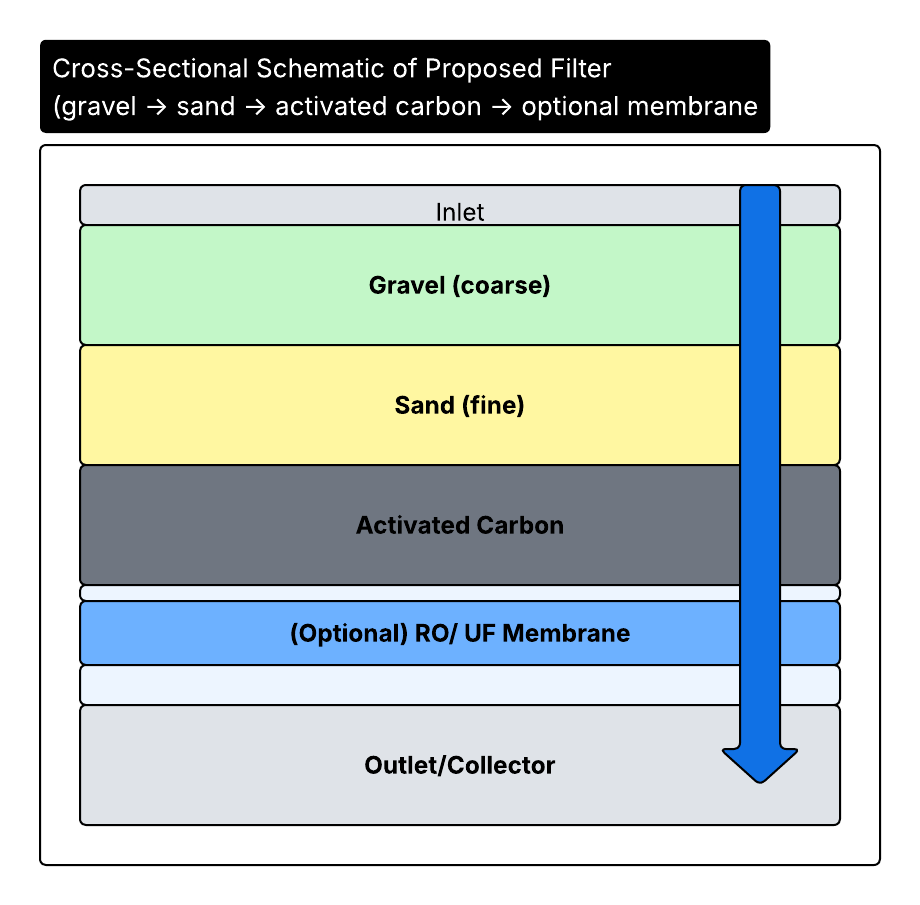

# 💧 Low-Cost Water Filtration System: Design Engineering Case Study
This project explores a **design engineering approach** to tackle India’s clean water challenge by creating a **low-cost, buildable water filtration system**.  
The workflow applies **Design Thinking, TRIZ (Theory of Inventive Problem Solving), HOQ (House of Quality), DFMEA (Design Failure Mode and Effects Analysis)**, and practical engineering trade-offs to propose an MVP (Minimum Viable Product).  

-purple)
 

---

## 🧩 Problem Statement  
Nearly **163 million people in India (12% of the population)** lack access to clean drinking water. Contaminated water is directly linked to diseases such as cholera, diarrhoea, and hepatitis A.  
The **objective** was to design a **low-cost, locally reproducible filtration system** that combines the strengths of RO systems and sewage treatment methods while remaining accessible for rural communities.  

---

## 🔬 Design Thinking Approach  

*This pipeline shows how the project followed a structured design thinking approach. Each stage (TRIZ, HOQ, DFMEA) reduced uncertainty and converted abstract problems (water scarcity) into a buildable solution with measurable performance.*

---
### TRIZ Summary  
Structured contradictions were mapped using TRIZ to guide design trade-offs.  

  

*TRIZ highlighted that cost, durability, and manufacturability trade-offs could be solved through modular design. This directly led to detachable compartments and segmented pipes, reducing failure risk while keeping the system maintainable in rural settings.*  

---

### House of Quality (HOQ) Flow  
We mapped customer needs → design attributes → engineering solutions.  

  

*The HOQ mapping revealed that customer trust hinged most on reliability and safety. These needs cascaded into engineering choices like filter-friendly materials and robust connectors, ensuring the design wasn’t just low-cost but also dependable.*  

### HOQ Priority Bar & Heatmap

  
  
*The HOQ analysis showed that “compact & lightweight” ranked above cost, signaling that portability and household integration mattered more than absolute price. This finding reshaped the BOM by prioritizing smaller casings and modular parts.*
---

### DFMEA (Failure Modes & Effects Analysis)  
To anticipate risks, we assessed severity, occurrence, and detection of potential failures.  

  

*The DFMEA exposed that human error (wrong compartment attachment) was a bigger risk than material failure. This insight justified adding color-coded connectors, a low-cost mitigation with high impact on system reliability.*  

---

## ⚙️ Proposed Design  

### Cross-Sectional Filter Schematic  
  

*The cross-section shows a scalable design: even without the RO/UF membrane, the system still delivers safe water. This flexibility makes it adaptable across income groups and infrastructure levels.*  

### System Diagram  
  

*This high-level view emphasizes the plug-and-play nature of the compartments. Each stage can be serviced or replaced independently, aligning with TRIZ “segmentation” principles.*  

---

## 📊 Cost & Practicality  

### Bill of Materials (BOM)  
  

*The BOM demonstrates that >60% of parts can be sourced locally (gravel, sand, pipes, connectors), keeping costs down and empowering community-level assembly without dependence on industrial supply chains.*  

---

### Cost vs Performance  
  

*This shows the design sits in the “sweet spot”: nearly matching commercial RO performance, but at ~40% lower cost. This balance validates the design as a viable alternative in low-resource contexts.  

---

### Impact Comparison  
  

*Impact analysis translates technical specs into human terms: one unit can provide safe water for a small household cluster, bridging the gap between individual filters and expensive community RO plants.*  

---

## 📈 Results & Insights  

- **Buildable**: All components available locally or through industrial suppliers.  
- **Scalable**: Can serve entire families or small communities.  
- **Balanced**: Better trade-off between cost, maintenance, and safety than simple sand filters or high-end RO units.  
- **Robust**: Risks identified through DFMEA, with clear mitigations.  

---

## ⚠️ Note on Data & Assumptions  

This project uses **reasonable engineering estimates** for cost, throughput, and impact.  
The following assumptions were made when building the visuals and comparisons:  

- **Unit Cost (~$50 per system):** Based on BOM estimates (gravel, sand, activated carbon, RO membrane, pipes, casing, connectors). Costs are relative, not tied to vendor quotes.  
- **Throughput (~50 L/day):** A conservative estimate assuming passive gravity flow. Actual flow may vary with membrane quality, water source turbidity, and maintenance frequency.  
- **Impact (10–12 people served per unit):** Based on WHO/UNICEF guidelines of ~4–5 liters per person/day for drinking and cooking needs.  
- **Comparative Methods (Boiling, Sand Filter, Commercial RO):** Plotted using normalized cost and effectiveness scores to illustrate trade-offs, not absolute laboratory data.  
- **Performance Measures:** Effectiveness ratings (1–5 scale) benchmark relative ability to remove pathogens and dissolved salts.  

👉 If extended into a **publishable study or field trial**, these figures should be anchored in **WHO/UNICEF/NGO water safety reports** or experimental validation.  

