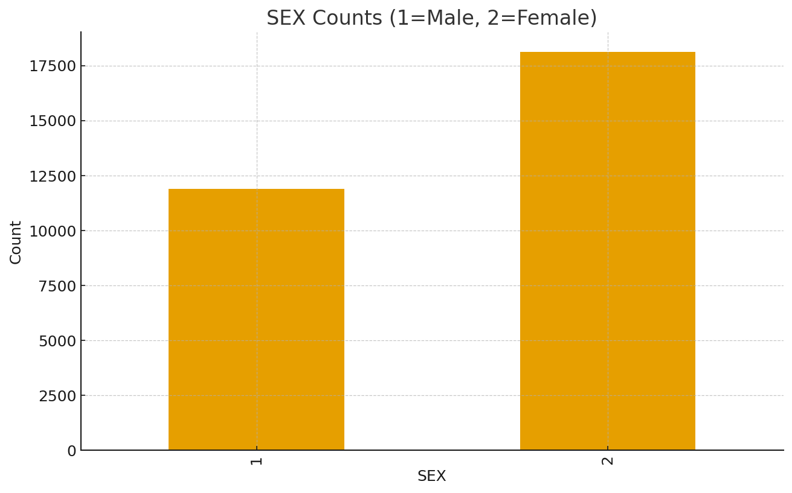
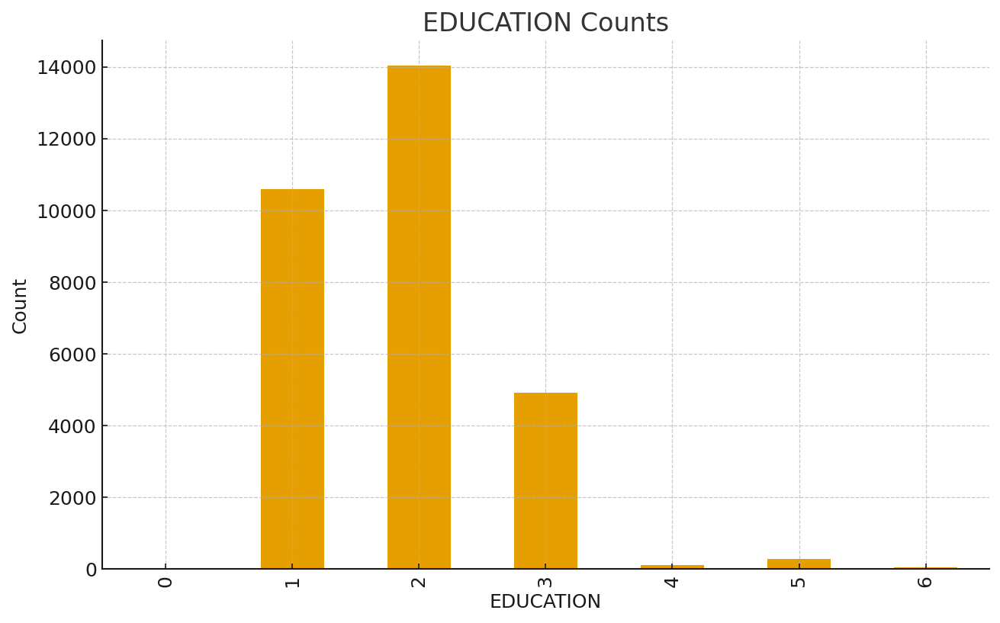
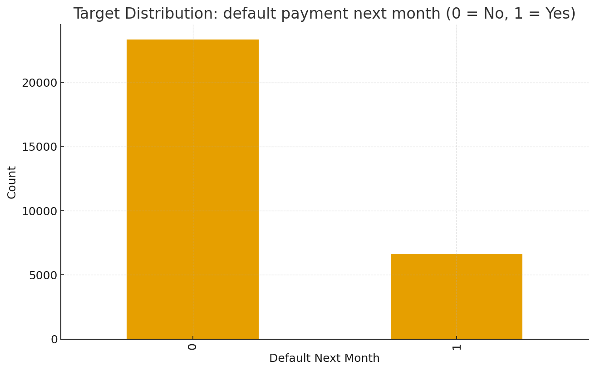
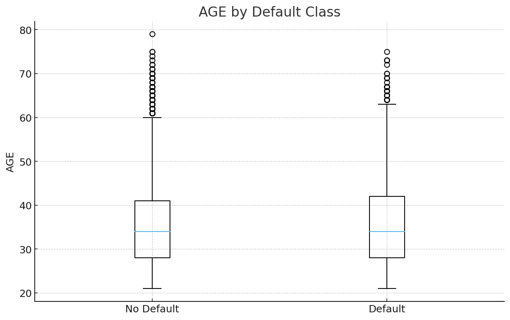
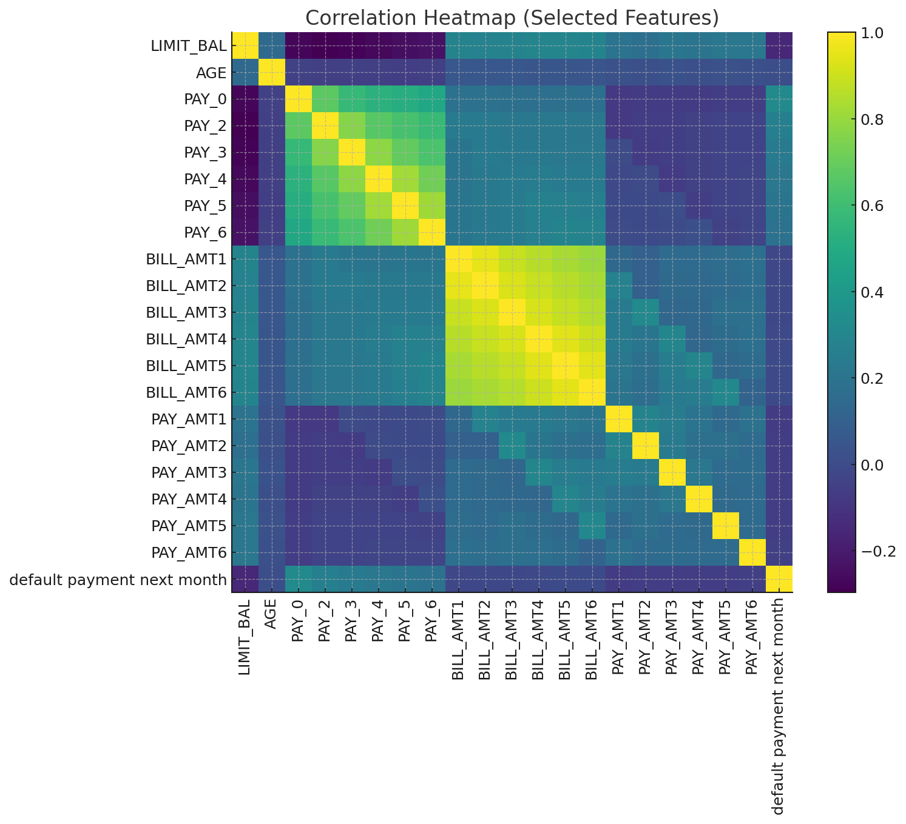
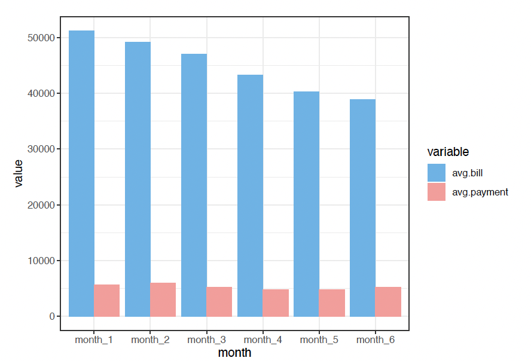
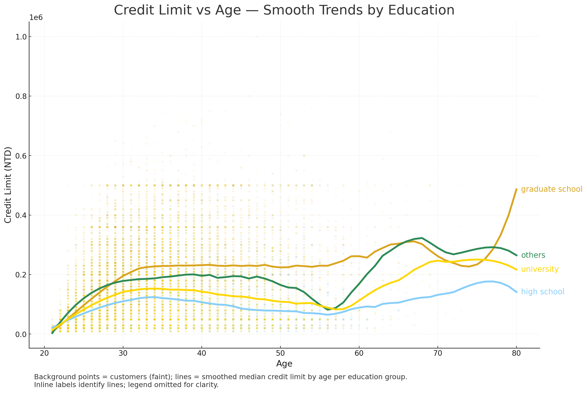
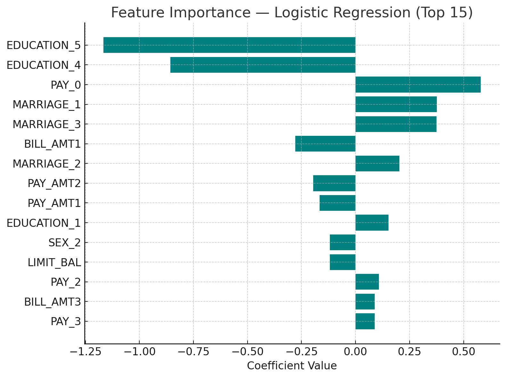
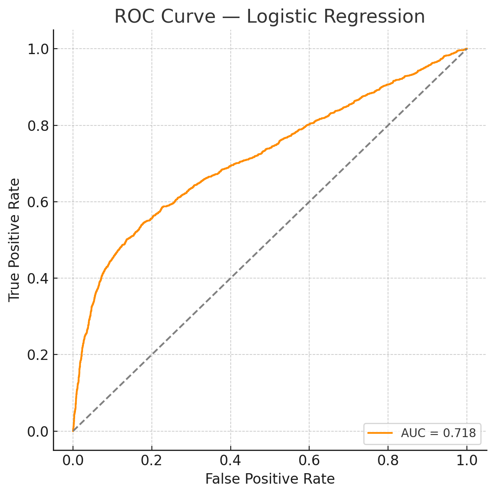
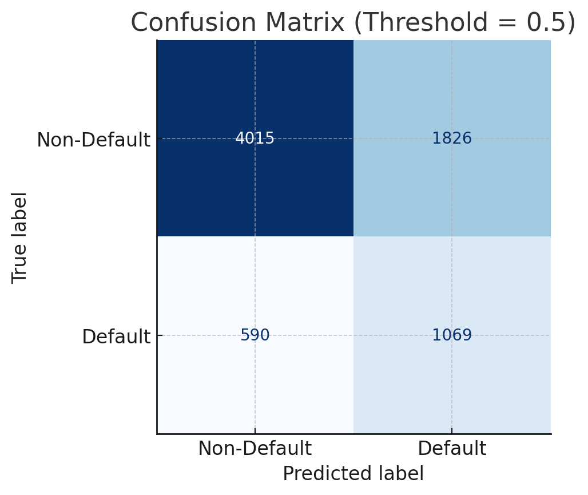

# Credit Risk Analytics: Understanding Customer Defaults with R

Exploring customer behavior and repayment trends using **R** to uncover drivers of **credit card payment defaults**.  
This project applies **credit risk analytics**, **data visualization**, and **customer segmentation** techniques to identify patterns that signal financial distress.

---

## 🧩 Problem Statement

Credit card defaults are one of the most common and costly risks faced by financial institutions.  
This project investigates **how customer demographics, credit limits, and repayment patterns** affect default probability, helping identify high-risk customer segments early.

---

## 📊 Dataset

- **Source:** UCI Machine Learning Repository – *Default of Credit Card Clients*  
- **Records:** 30,000 clients (Taiwan, 2005)  
- **Target:** `df_pay` → 1 = Default, 0 = No Default  
- **Categories:**  
  - **Demographic:** SEX, EDUCATION, MARRIAGE, AGE  
  - **Financial:** LIMIT_BAL, BILL_AMT1–6, PAY_AMT1–6  
  - **Behavioral:** PAY_0–PAY_6 (repayment status for last six months)

---

## ⚙️ Workflow Overview

1. **Data Wrangling (R):** cleaned categorical encodings, grouped anomalies, renamed variables.  
2. **Exploratory Analysis (R):** visualized distributions, repayment trends, and credit relationships.  
3. **Modeling (Python):** logistic regression (balanced) + ROC, confusion matrix, and coefficients.  

---

## 📈 Exploratory Data Analysis

### 1) Customer Demographics
 

*Majority of clients are female and university-educated — a young professional customer base.*

*Married and single clients dominate; marital stability aligns with stronger repayment discipline.*

---

### 2) Default Distribution

*About 22% of clients defaulted, highlighting a class imbalance typical of real portfolios.*

---

### 3) Credit Limit Patterns
 

*Defaulters generally have lower credit limits; higher limits tend to follow clean repayment histories.*

---

### 4) Age Influence
 

*Most clients are 25–40. Older customers default less in absolute terms, though overlap remains high.*

---

### 5) Repayment Behavior Snapshot

*On-time status (0) dominates, while 1–2 month delays are early stress signals.*

---

### 6) Correlations

*Bills across months are highly correlated; recent repayment status features align most with default.*

---

### 7) Monthly Bill vs Payment (Portfolio Averages)

*Billed amounts trend down slightly, while payments stay lower — a sign of revolving balances.*

---

### 8) Credit Limit vs Age — Smooth Trends by Education

*Credit limits rise with age across groups; graduate/university lines sit above others.*

---

## 🧠 Predictive Modeling (Python)

**Logistic Regression** with `class_weight="balanced"` to handle the 78/22 split.  
Stratified train/test split; evaluation emphasizes recall vs. business cost trade-offs.

### Feature Importance (Coefficients)

*Recent delinquency (PAY_0) is most predictive; higher credit limits dampen risk.*

### ROC Curve

*AUC = **0.718** — reasonable ranking power between classes.*

### Confusion Matrix (Threshold = 0.50)

*Recall for defaulters is prioritized; precision can be improved via threshold tuning.*

---

## 📈 Model Results

| Metric | Value |
|---|---|
| **Accuracy** | ~**67.9%** |
| **Precision** | ~37% |
| **Recall** | ~64% |
| **F1-Score** | ~47% |
| **ROC-AUC** | **0.718** |

---

## 💡 Key Insights

- **Repayment consistency** (PAY_* variables) is the clearest signal of default.  
- **Lower credit limits** and **younger age** correlate with higher risk.  
- Explainable baseline shows how **EDA + simple modeling** provides actionable risk insight.

---

## 🚀 Next Steps

- Ensembles (Gradient Boosting / XGBoost) with calibrated probabilities.  
- Threshold optimization using business costs.  
- Drift & fairness checks by segment; optional R Shiny dashboard.

---

## 📘 Supplementary R Notebook

`Credit_Card_Default_Analysis.Rmd` includes:  
- Data cleaning & recoding  
- All EDA visuals above  
- Notes on feature construction and anomalies
