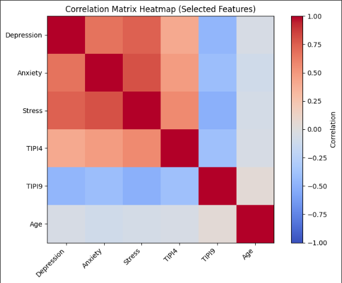

# Depression, Anxiety & Stress Predictor  

This project uses the **DASS-42 survey dataset (~40K responses)** to predict mental health severity levels (Normal → Extremely Severe) based on personality traits and demographics.  

 
 
 
 
 
 
 
 
 
 
 

---

## 🧩 Problem Statement  
Mental health conditions such as depression, anxiety, and stress impact quality of life and productivity. Using survey data, we built predictive models to classify individuals into severity categories, aiming to demonstrate how data-driven approaches can support early detection.  

---

## 📊 Dataset  
- **Source**: DASS-42 Survey (Depression, Anxiety and Stress Scales).  
- **Responses**: ~40,000 participants.  
- **Format**: Likert scale (1 = Did not apply, 4 = Applied most of the time).  
- **Features**: Personality questions (TIPI), demographics (age, gender, education, religion, urbanicity).  
- **Target**: Depression severity (Normal, Mild, Moderate, Severe, Extremely Severe).
   
### ⚠️ Dataset Access
The original dataset is not included in this repository.  
You can download the DASS-42 dataset or use your own survey data.  
Update the file path in `df_dass = pd.read_csv("path/to/DASS_data.csv", sep="\t", engine="python")` before running.

---

## ⚙️ Approach  
1. **Data Preprocessing**  
   - Null value checks, outlier removal.  
   - Variable selection, normalization, feature encoding.  

2. **Exploratory Data Analysis (EDA)**  
   - Age & gender distributions.  
   - Correlations (e.g., TIPI4 = anxious → higher depression; TIPI9 = calm → lower depression).  
   - Demographic insights (religion, marital status).  

3. **Models Tested**  
   - Logistic Regression  
   - Random Forest  
   - Decision Tree  
   - K-Nearest Neighbors (KNN)  

4. **Dimensionality Reduction**  
   - PCA applied (26 → 15 features).  
   - Improved accuracy for most models except Logistic Regression.  

---

## 📈 Results  

| Model                | Accuracy | Precision | Recall | F1   |  
|----------------------|----------|-----------|--------|------|  
| **Logistic Regression** | **90.8%** | 90.7%    | 90.8%  | 90.6% |  
| Random Forest        | 88.3%    | 88.1%    | 88.3%  | 88.1% |  
| KNN                  | 82.2%    | 81.3%    | 82.3%  | 80.9% |  
| Decision Tree        | 77.0%    | 78.7%    | 78.6%  | 78.7% |  

- Logistic Regression performed the best, despite being the simplest model.  
- PCA improved Random Forest and KNN performance.  

---

## 🎨 Visuals  

**Pipeline (ML Workflow)**  
Step-by-step pipeline from dataset to results.  

---

**Model Accuracy Comparison**  
Logistic Regression performed the best (90.8%), followed by Random Forest.  

---

**PCA Cumulative Variance Explained**  
15 components retained ~60% variance, balancing efficiency and accuracy.  

---

**Focused Correlation (Personality vs Depression)**  
- TIPI4 (Anxious) strongly positive with Depression.  
- TIPI9 (Calm) strongly negative with Depression.  

---

**Expanded Correlation Matrix (Selected Features)**  
- Depression, Anxiety, and Stress are highly correlated.  
- Personality traits (TIPI4, TIPI9) are stronger predictors than Age.  

---

## 💡 Key Insights  
- Personality traits strongly influence depression severity (TIPI4 = anxious, TIPI9 = calm).  
- Younger and urban populations reported higher depression levels.  
- Married participants generally had lower depression scores.  
- Logistic Regression provided the most reliable classification.  

---

## 🚀 Next Steps  
- Extend modeling to Anxiety and Stress severity classification.  
- Explore deep learning models for larger-scale datasets.  
- Apply results to design targeted mental health interventions.  

