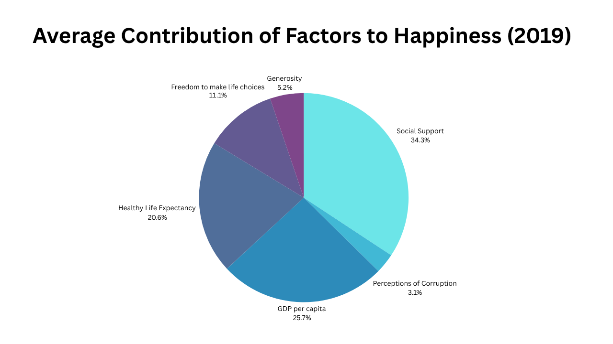
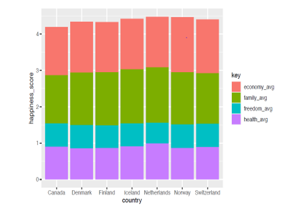
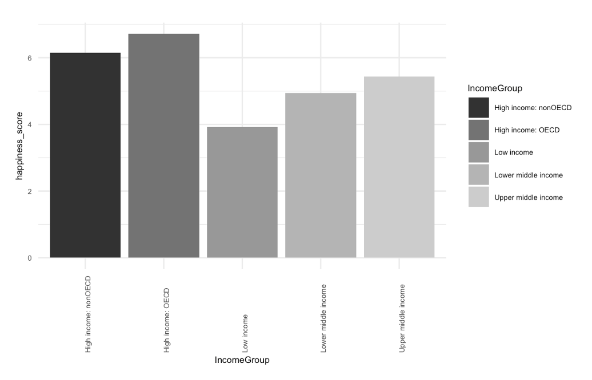
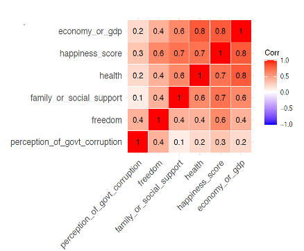
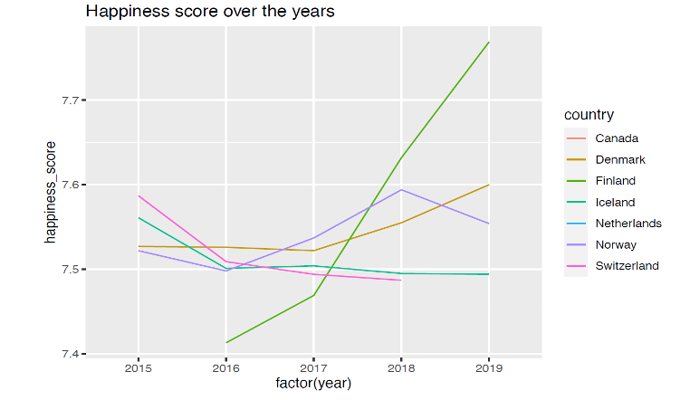
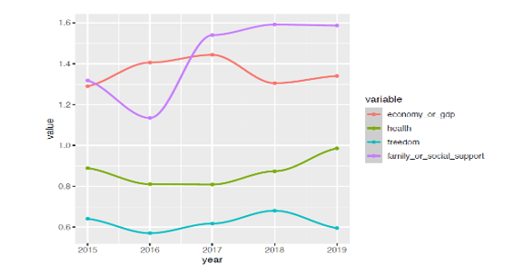
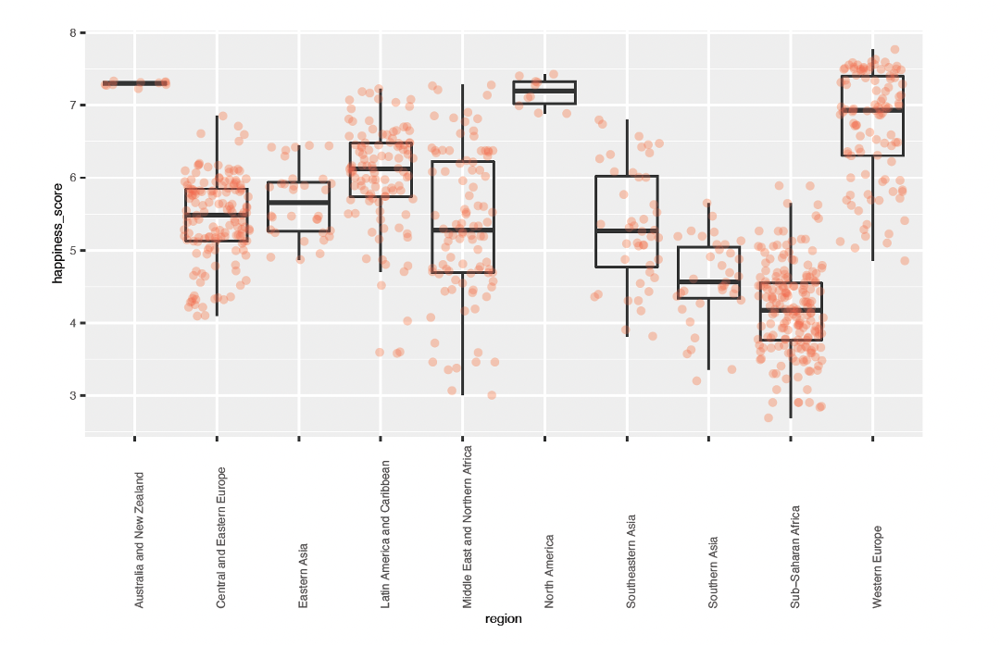

# 🌍 World Happiness Analysis (2015–2019)

Understanding what makes people happier, across countries, regions, and years, through data-driven analysis.  
This project explores the **World Happiness Report datasets (2015–2019)** using **R** to uncover which factors most strongly influence happiness levels globally.

 
 
 

---

## 🧩 Objective
Identify the **key socio-economic factors** that drive happiness and visualize how they vary across time and geography.

---

## 🧠 Methodology Workflow

**Workflow Overview:**
1. **Problem Definition** → Identifying key factors influencing happiness levels  
2. **Data Collection** → World Happiness Report datasets (2015–2019)  
3. **Data Wrangling** → Cleaning, merging yearly datasets  
4. **Exploratory Data Analysis (EDA)** → Visualizing factor patterns  
5. **Statistical Analysis** → Correlation, regional, and temporal comparisons  
6. **Results & Insights** → Visual summaries, trends, and relationships  

> This workflow connects exploratory data analytics with statistical insights to explain *why* certain countries rank happier than others.

---

## 📊 Key Visuals & Insights

### 1️⃣ Global Distribution of Happiness

*Displays global happiness scores, showing how happiness levels cluster across continents. The geographic gradient highlights socio-economic and cultural disparities.*

---

### 2️⃣ Factor Contribution to Global Happiness
 

*Social support, GDP, and health are the dominant contributors to happiness globally in 2019, emphasizing the human and economic foundations of wellbeing.*

---

### 3️⃣ Top Performing Countries Breakdown

*Among the happiest nations (e.g., Finland, Denmark, Iceland), the largest contributors are social trust and support, while freedom and generosity remain consistent secondary factors.*

---

### 4️⃣ Income vs Happiness

*Higher-income groups consistently report greater happiness, showing that economic stability underpins subjective well-being across countries.*

---

### 5️⃣ Factor Correlation Heatmap

*Strong positive correlations appear between GDP, health, and social support — indicating these variables move together in shaping happiness.*

---

### 6️⃣ Factor Trends Over Time

*Over 2015–2019, social support and GDP steadily increased, reinforcing their stable role in determining overall happiness.*

---

### 7️⃣ Country-Level Factor Trends

*Finland’s steady rise in happiness aligns with increases in GDP and health scores, matching its top global ranking in the report.*

---

### 8️⃣ Regional Distribution

*Western Europe and Australia consistently outperform other regions in happiness, while Sub-Saharan Africa and South Asia lag behind.*

---

## 💡 Summary of Findings
- **Top global happiness drivers:** Social support, GDP per capita, and health.  
- **Regions with highest consistency:** Western Europe, North America, Australia.  
- **Emerging insight:** Even small improvements in social trust and health yield disproportionate gains in happiness.  

> Together, these findings emphasize that well-being is multidimensional, balancing economic prosperity with human connection and health.

---

## 🔗 Project Assets 
🎨 Visuals: `/visuals` folder   
▫️ Data: `/data` folder

---

