# 🧬 Biofilm Detection on Corneal Tissue using SERS + Machine Learning  

This project combines **Surface-Enhanced Raman Spectroscopy (SERS)** with **machine learning** to detect **Pseudomonas aeruginosa (PA01) biofilms** on **pig corneal tissue**.  
It is the **first known application of SERS + ML for corneal biofilm diagnostics**, achieving **~92.5% accuracy** with perfect specificity.  

In addition to classification, the project includes **silver nanoparticle synthesis optimization** validated using **ANOVA** and **Fisher’s test**.  

---

## 🧩 Problem Statement  

Corneal biofilm infections are difficult to detect early due to weak Raman signals and tissue heterogeneity.  
Traditional diagnostic methods are **slow, invasive, and time-consuming**, leading to delayed treatment and higher risk of vision loss.  

This project demonstrates that combining **nanoparticle-enhanced Raman spectroscopy** with **machine learning** can deliver an **accurate, non-invasive diagnostic approach**.  

---

## 📊 Dataset  

- **Samples**: Pig cornea inoculated with or without PA01 biofilm  
- **Spectra**: ~1024 wavenumber intensity points per sample  
- **Preprocessing**: interpolation → baseline correction (**airPLS**) → smoothing (**Savitzky–Golay**) → normalization  
- **Classes**:  
  - `0 = bacteria absent`  
  - `1 = bacteria present`  

---

## ⚙️ Workflow  

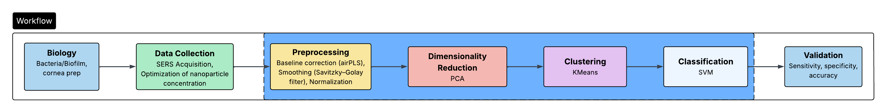  

**End-to-end workflow:**  
- *Left*: Corneal prep and SERS acquisition with optimized nanoparticles  
- *Middle (highlighted)*: Preprocessing → PCA → KMeans → SVM classification pipeline  
- *Right*: Validation using sensitivity, specificity, and accuracy  

---

## 🎨 Visuals  

### 1. Experimental Setup & Nanoparticle Validation  

- **SERS setup schematic**  
  Experimental configuration for capturing Raman spectra from corneal tissue using silver nanoparticles.  
  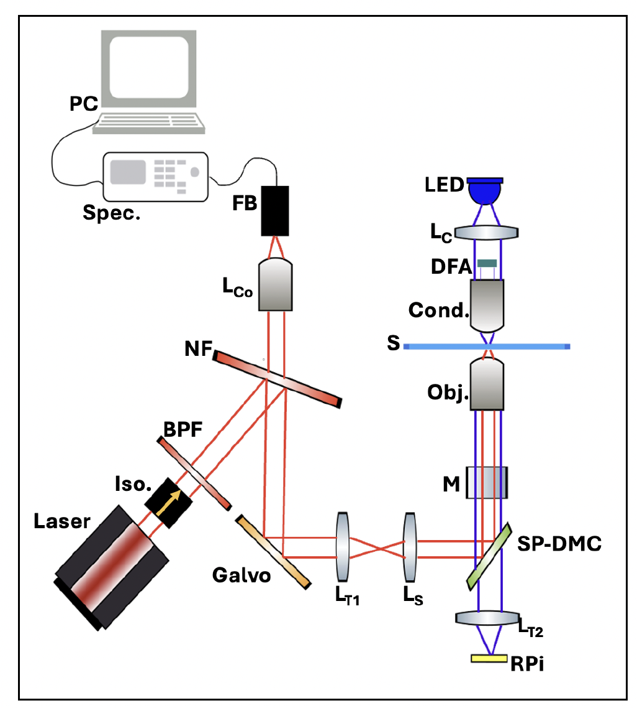  

- **Nanoparticle synthesis**  
  Colloidal silver nanoparticles confirmed with UV-Vis absorption spectra.  
    

- **Enhancement calculations**  
  Quantification of Raman signal amplification achieved with nanoparticles.  
  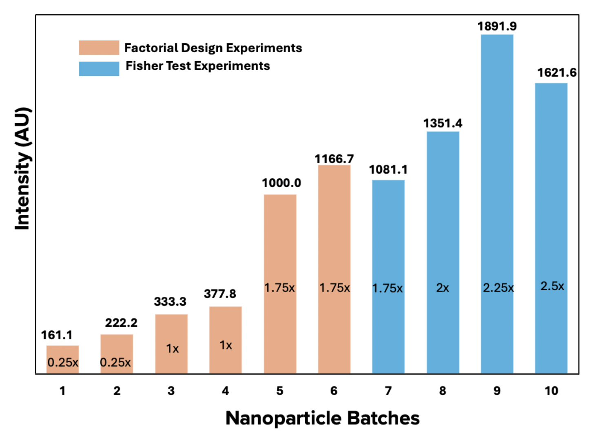  

- **Optimization experiments**  
  Signal strength across different nanoparticle concentrations and interaction times. ANOVA + Fisher test confirmed the optimized condition was statistically significant.  
  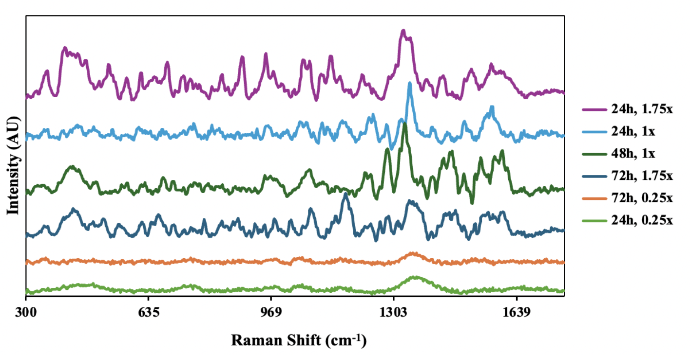  

---

### 2. Spectral Signatures (Raw vs Preprocessed)  

- **Spectrum without biofilm**  
  Raman spectrum of corneal tissue without PA01 biofilm (control).  
  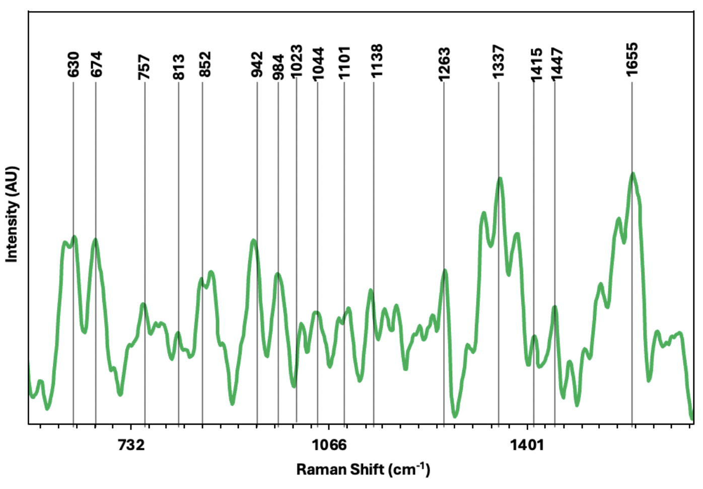  

- **Spectrum with biofilm**  
  Raman spectrum of corneal tissue with PA01 biofilm present.  
  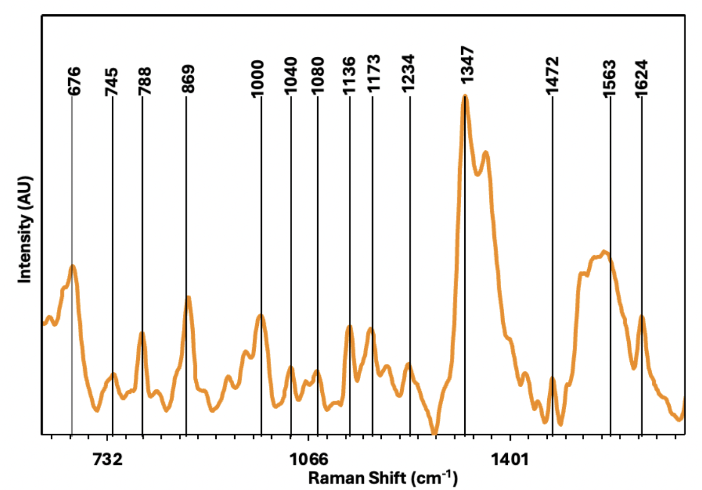  

- **Raw biofilm spectrum**  
  Example of an unprocessed spectrum showing baseline drift and noise.  
  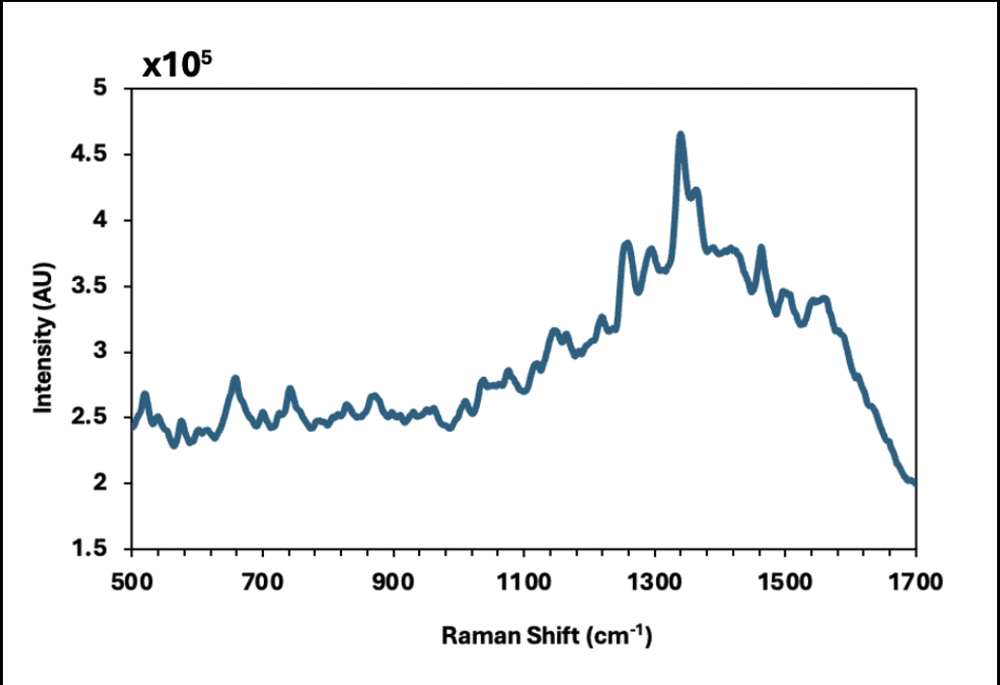  

- **Preprocessed spectrum**  
  After baseline correction (airPLS) and smoothing (Savitzky–Golay), the signal is cleaner and comparable across samples.  
  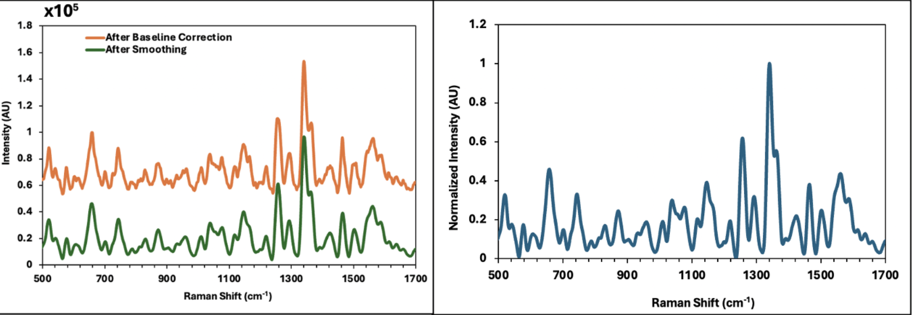  

---

### 3. Dimensionality Reduction & Clustering  

- **PCA variance explained**  
  ~30 principal components capture >95% of the variance, reducing dimensionality from 1024 features.  
  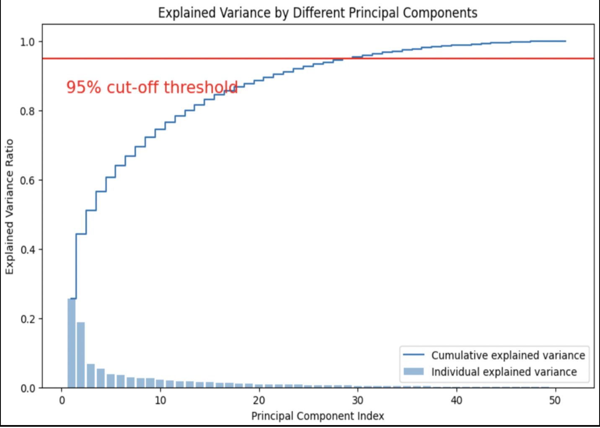  

- **PCA visualization**  
  Spectral data separates along PCA axes, showing intrinsic group differences.  
  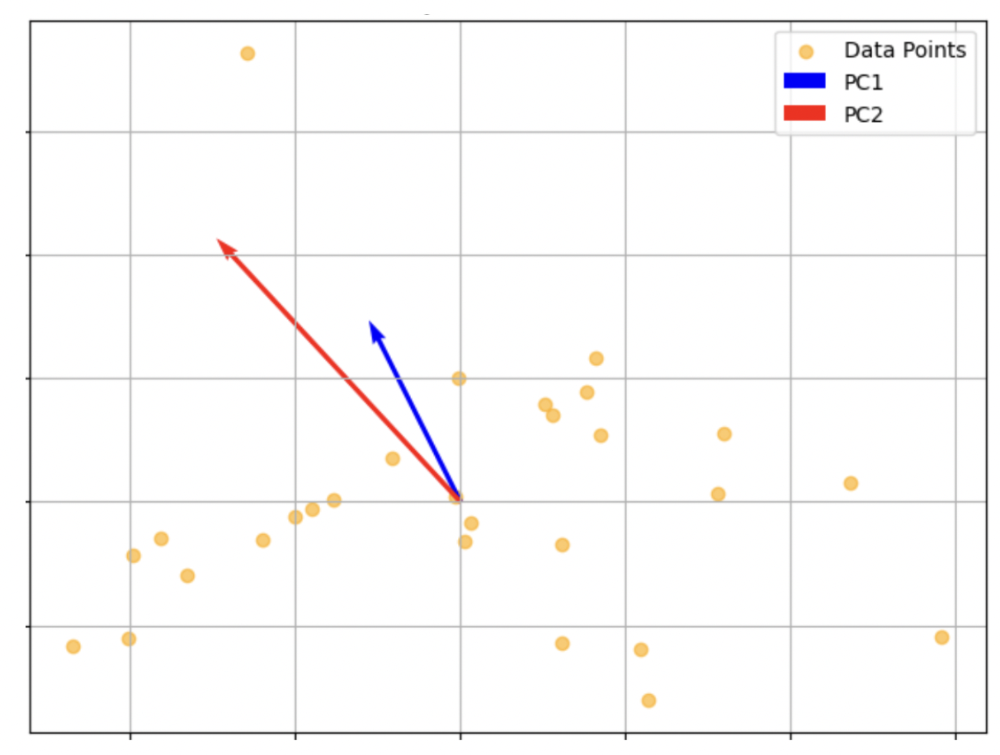  

- **KMeans clustering**  
  Clustering accounts for intra-sample variability before classification.  
  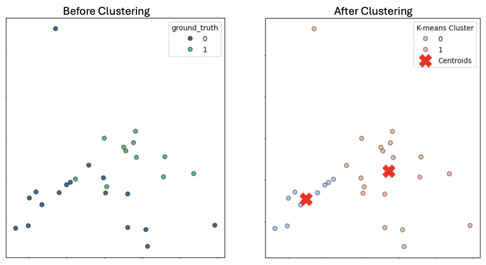  

---

### 4. Classification & Results  

- **Performance metrics**  
  Comparison of model performance across variants. The final pipeline (SVM + PCA + KMeans) achieved 92.5% accuracy with perfect specificity.  
  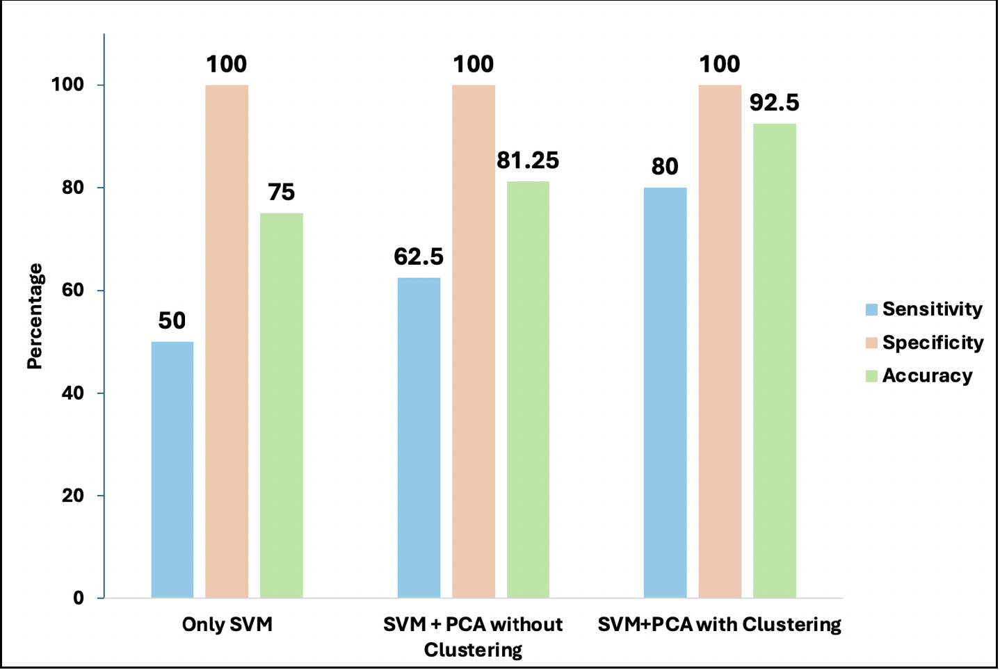  

- **Confusion matrices**  
  Breakdown of classification outcomes: perfect specificity (no false positives) and strong sensitivity. 
    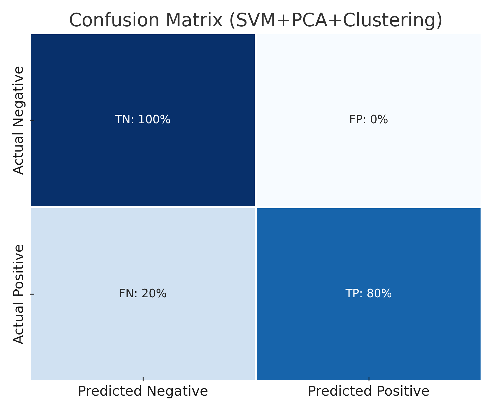  
  

---

## 📈 Key Results  

| Model Variant             | Sensitivity | Specificity | Accuracy |
|---------------------------|-------------|-------------|----------|
| SVM only                  | 50%         | 100%        | 75.0%    |
| SVM + PCA                 | 62.5%       | 100%        | 81.3%    |
| **SVM + PCA + KMeans**    | **80%**     | **100%**    | **92.5%** |

---

## 💡 Key Insights  

- **Novelty**: First demonstration of **SERS + ML on corneal tissue** for biofilm detection  
- **Nanoparticle validation**: Optimization statistically validated with ANOVA + Fisher test  
- **ML pipeline**: PCA + KMeans preprocessing improved classification robustness  
- **Performance**: 92.5% accuracy with perfect specificity  
- **Clinical impact**: Potential pathway for **fast, non-invasive ocular diagnostics**  

---

## 🚀 Next Steps  

- Expand dataset with **different bacterial strains**  
- Extend to **human corneal samples**  
- Explore **deep learning models** for Raman spectra  
- Develop **point-of-care diagnostic prototype**  

---

## 📚 Thesis 

- **Published version (DOI)**: see [``]()  

---

## ⚖️ Disclaimer  

This project is for **academic and portfolio purposes only**. It is **not** intended for direct clinical use.  
